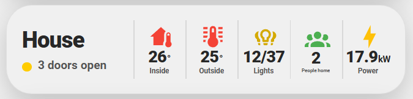
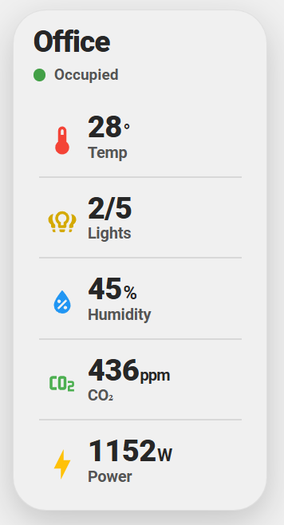
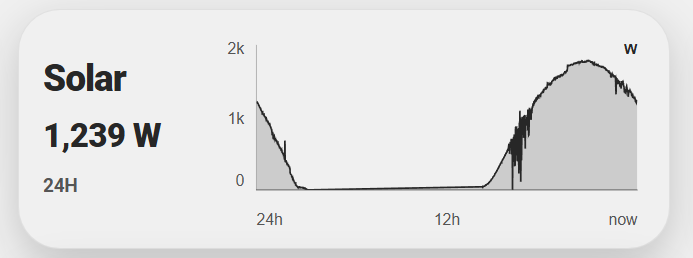
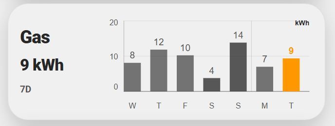
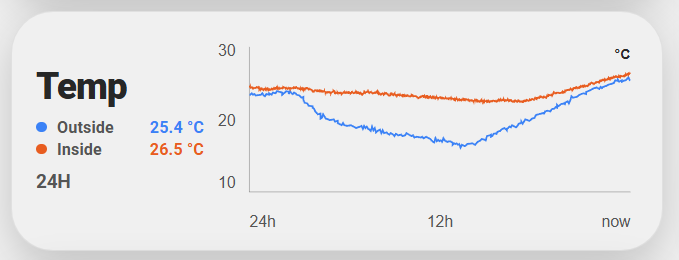

# Area Glance Card

**A compact Home Assistant card that turns an area, home system, camera set, or sensor history into a clear live summary.**

[](https://my.home-assistant.io/redirect/hacs_repository/?owner=Future-Surfer&repository=ha-area-glance-card&category=plugin)


Pick an area in the visual editor and Area Glance suggests the useful things already assigned to it. Keep the suggestions, swap them, or build a deliberate summary from selected entities.

## Start here

1. Install with HACS using the button above.
2. Add **Area Glance Card** to a dashboard and open its visual editor.
3. Choose **An area**, select a room, and leave the starter profile on **Auto**.

```yaml
type: custom:area-glance-card
area: living_room
```

If HACS has not added the resource, add it manually:

```yaml
url: /hacsfiles/ha-area-glance-card/area-glance-card.js
type: module
```

## What it can show

- **Areas and home activity:** temperature, humidity, lights, power, motion, presence, people home, doors, windows, blinds, locks, leaks, and alarms.
- **Air and devices:** CO₂, PM2.5, VOC, AQI, weather, media, robot vacuums, clocks, calendar dates, cameras, and custom combinations.
- **System profiles:** Whole home, Energy Dashboard, Home battery, Security, and up to three camera previews from separate camera devices.
- **Chart history:** single or multi-series line/area history, columns, and daily totals from a recorded entity or compatible Energy Dashboard source.

Matching favours Home Assistant domains, device classes, units, and Energy Dashboard configuration rather than loose entity-name matching.

## Layouts and charts

Choose a compact band, title-above layout, insight-only card, or a one-column Insight tower. Cards resize their visible insights automatically.





Chart cards keep one live summary alongside a deliberately restrained plot.







## Make it yours

Rearrange, duplicate, remove, or swap insights in the editor. Each area aggregate can automatically include new compatible devices; exclude an outlier while retaining that automatic discovery, or choose a precise group of entities instead.

Tap an aggregate to inspect its contributors. Lights offer individual and all-lights toggles; temperature and power show summary statistics. Energy and battery cards reveal the configured Energy Dashboard sources that drive each metric.

Appearance controls include height, background, raised or inset shadow, optional area icon, card-wide text sizing and weight, and default insight icon treatment. Individual insights can still override their own colour, label, icon, unit, decimals, aggregation, and actions.

## Portable showcase

[The maintained showcase stack](examples/showcase.yaml) demonstrates the main profiles, layouts, and appearance options. Its `area: 1`, `area: 2`, and `area: 3` values are portable showcase slots: they resolve to the first, second, and third real areas in the current Home Assistant instance, then use those actual areas for titles, suggestions, and aggregates.

For normal dashboard cards, use the regular area ID such as `area: living_room`. A missing showcase slot stays empty; it never falls back to an unrelated room or whole-home aggregate.

## Troubleshooting

For room-level suggestions, assign devices or entities to an area in Home Assistant. If an expected device is missing, check its area assignment and device class or unit, then use **A specific entity** or **Selected entities** for intentional exceptions.

Leave the area empty for whole-home aggregates. Energy without an area uses configured Energy Dashboard sources; it does not guess from entity names. Security reports only the monitored entities it can identify and does not claim complete home coverage.

## Development

Run `npm install`, `npm run check`, then `npm run build`. Commit the generated [area-glance-card.js](area-glance-card.js) with source changes. See the [architecture notes](docs/architecture.md) before extending automatic matching or actions.
