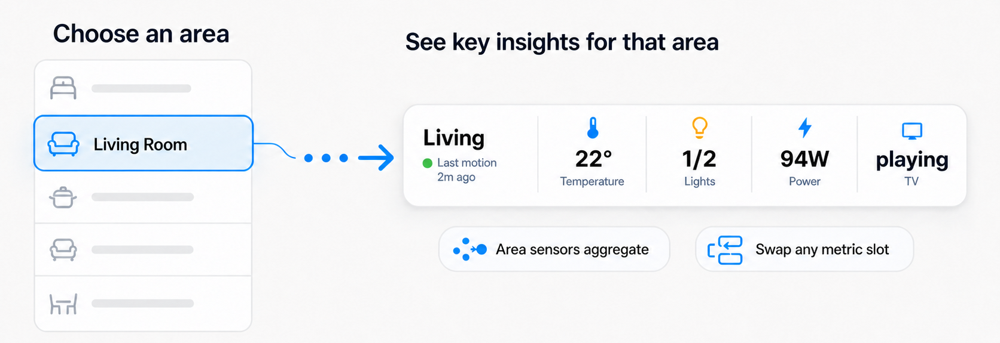
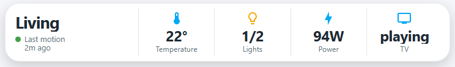
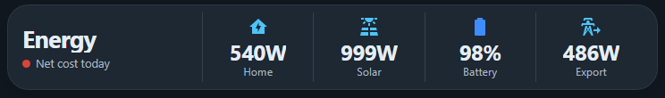

# Area Glance Card

Pick an area and Area Glance turns its scattered sensors and devices into one compact, live summary.

## How to use



## What it does

- Makes a compact band with a status and up to five metrics.
- Defaults to useful area aggregates: motion, median temperature/humidity, lights on/total, summed live power, and highest CO2.
- Lets you switch any supported metric to one specific entity instead.
- Includes a guided visual editor, starter profiles, height choices, and appearance presets.





## Install

In HACS, add this repository as a **Dashboard** repository and download it. Add the resource if HACS has not done so automatically.

For a manual install, copy [area-glance-card.js](area-glance-card.js) to `config/www`, add it as a JavaScript module resource, then use `custom:area-glance-card`.

## Start here

```yaml
type: custom:area-glance-card
area: living_room
status:
  source: area_motion
  show_last_changed: true
metrics:
  - preset: temperature
    source: area
  - preset: lights
  - preset: power
    source: area
  - preset: device
    entity: media_player.lounge
    label: TV
```

Open the visual editor to pick a starter profile, change a metric to a specific entity, or adjust the layout and appearance.

## Development

Run `npm install`, `npm run check`, then `npm run build`. The generated [area-glance-card.js](area-glance-card.js) is the release file.
